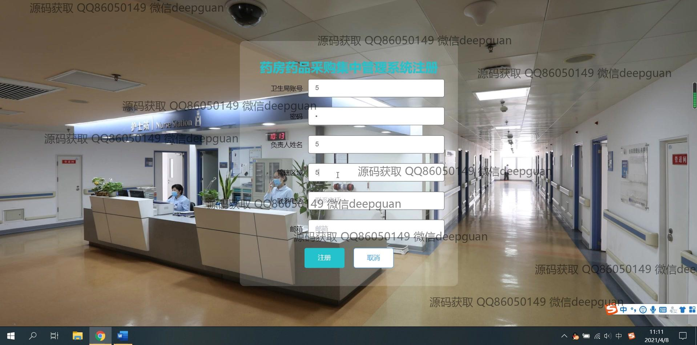
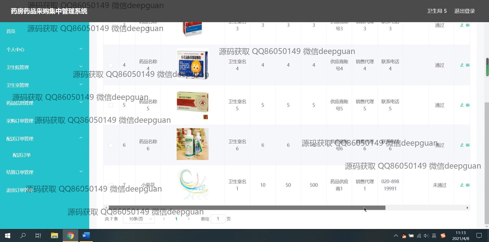
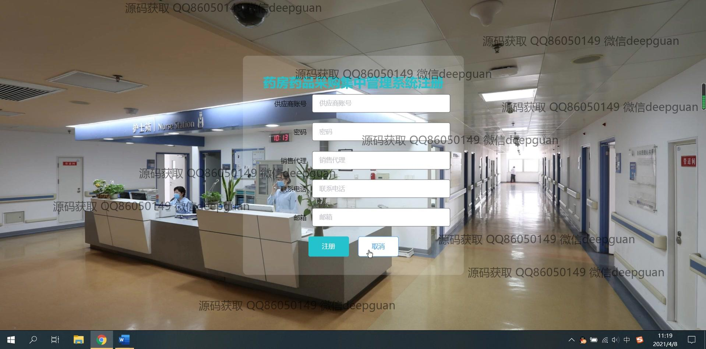

<h1 align="center">基于SSM的药房药品采购集中管理系统的设计与实现+vue</h1>

## 简介
药房药品采购集中管理系统：实现管理员对药品采购、供应商、订单、库存、退货等模块的高效管理，支持信息录入、审核、统计分析及角色权限分配，提升药品管理效率。    --计算机毕业设计源码；毕设源码；java毕业设计源码

## 联系方式

<h3 align="center">获取完整代码与数据库文件 + 微信：deepguan QQ: 86050149 QQ群: 783742310</h3>

<h3 align="center">可帮忙远程部署 包运行成功！提供远程部署、修改代码、设计文档指导、代码讲解等服务！</h3>

## 功能介绍（完整见运行截图）
管理员：基本功能包括登录、注册和退出。提供系统主要模块的导航，如个人中心、卫生管理、药品信息管理、采购订单、配送订单、结算订单和退货订单管理，便于进行统一管理和监控。管理药品信息、库存及采购订单，支持药品信息的添加、更新和删除，同时进行采购申请的审核和状态更新。管理员可以查看和修改个人信息，并进行用户管理，权限分配，确保系统的安全性和操作权限的准确性。

用户：用户注册并登录系统后，可以访问主页和主导航栏，查看药品信息列表，进行商品搜索，了解采购订单状态，管理自己的采购购物车以及结算操作。提供药品详情查看功能，包括药品的编号、名称、生产日期、批次和单位信息等。用户可以录入和更新药品采购申请，查看供应商信息以及订单的历史记录，方便进行实时库存查询和管理，提升药品采购的效率与准确性。

## 运行截图

本代码来源于网络,仅供学习参考使用!

